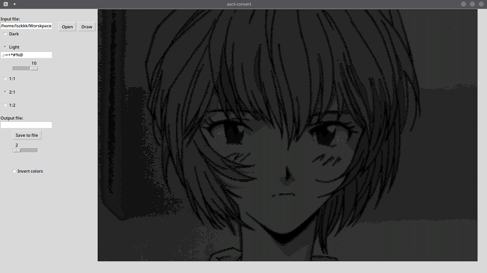

# ASCII-CONVERT
## What is it
An Image to ASCII converter capable of turning images (.bmp, .png, .jpg, etc.) into ASCII characters. Can convert in 1:1, 2:1 and 1:2 modes. Is actually a GUI for version of the [CLI](https://github.com/laszekQ/ascii-convert) version

### What's the difference between 1:1, 2:1 and 1:2?
When we convert an image to ASCII 1:1, the output looks a bit vertically stretched because in most fonts the characters are 2 times longer in hight comparing to width. And in 1:1 mode, every pixel from the image is mapped to a single ASCII character, while in 2:1, every 2 pixels (taken vertically) are mapped to a single character, making the output look natural, 1:2, on the other hand, stretches the output horizontaally, repeating every character twice.

## Usage
1. Select your input file
2. Select color mode
3. Input a custom gradient if you want to
4. Select how many characters from the gradient you would like to see
5. Select conversion mode
6. If you want to save the result to a file, enter its full name along with its extension
7. The slider on the bottom lets you regulate the font size of the text on the right side
8. You can invert the color of the textbox using the checkbox on the very bottom

### Demonstration (light color mode, 10 length, 2:1, dark color mode for the textbox)



## External libraries
[SFML 3.0.0](https://www.sfml-dev.org/) is used to open image files and get pixel colors.

## Build and Run
I built it on Linux using **CMake**. You can do the same by running:
```bash
cmake .
make
```
in the project folder. However, if you are building on **Windows**, **you may encounter some problems** with SFML dependencies.<br>
You also need to move the built `ascii_convert.so` into the `src/` folder so Python could find it easily. Run the program simply:
```bash
python ./main.py
```
